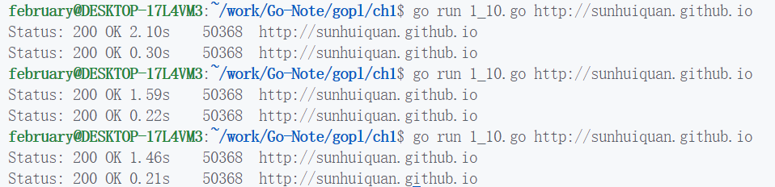
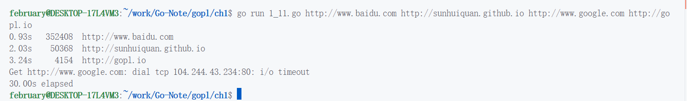
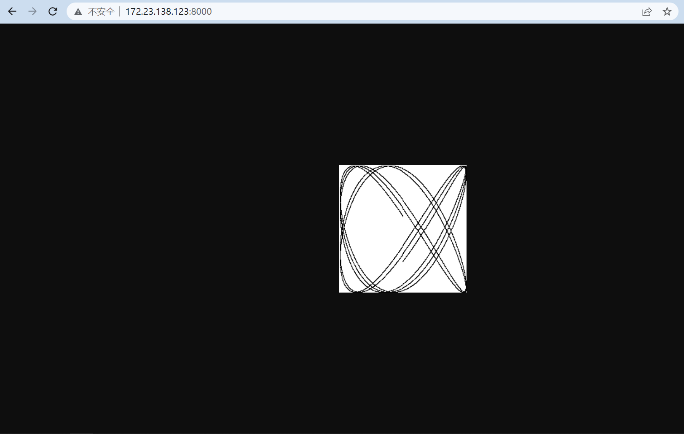

# Go-Note
Learn how to use go.

## 前言

使用环境是 WSL2 + VSCode，然后由于本人刚刚开始学习 Go，所以目前并不会使用 go mod 来配置项目，该项目目前是直接配置在 GOPATH 下的，以后学会用 go mod 管理再改。

## 《GO 程序设计语言》

### CH1 入门

#### 1.1

[练习1.1](./src/gopl/ch1/1_1.go)

#### 1.2

[练习1.2](./src/gopl/ch1/1_2.go)

#### 1.3

[练习1.3](to do)

#### 1.4

[练习1.4](./src/gopl/ch1/1_4.go)

#### 1.5

[练习1.5](./src/gopl/ch1/1_5.go)

#### 1.6

[练习1.6](./src/gopl/ch1/1_6.go)

#### 1.7

[练习1.7](./src/gopl/ch1/1_7.go)

#### 1.8

[练习1.8](./src/gopl/ch1/1_8.go)

#### 1.9

[练习1.9](./src/gopl/ch1/1_9.go)

#### 1.10

[练习1.10](./src/gopl/ch1/1_10.go)，注意要修改代码，而且在同一个进程内连续访问，才能看到这种缓存的效果。

#### 1.11

[练习1.11](./src/gopl/ch1/1_11.go)，会等待一段时间后超时错误，我这里是关上 vpn 然后测试 google。

#### 1.12

[练习1.12](./src/gopl/ch1/1_12.go)，命令行输入 go run 1_12.go web & 后台运行服务器，然后浏览器 localhost:8000 访问即可。

至于为什么我不用 localhost 是因为我用的是 wsl2，windows 下访问 wsl2 的子系统网络需要对应的 ip (可以在 ip addr | grep eth0 获取)，另外对应的 go 源程序也要把 localhost 改成对应的要监听的网卡 ip。

### CH2 程序结构

#### 2.1

[练习2.1](./src/gopl/ch2/2_1/main.go)

#### 2.2

[练习2.2](./gopl/ch2/2_1)

#### 2.3

[练习2.4](./gopl/ch2/2_1)

#### 2.4

[练习2.4](./gopl/ch2/2_1)

#### 2.5

[练习2.5](./gopl/ch2/2_1)

---

## 与C、C++的区别

1. map是基于哈希的，无需。另外和 c++ 不同的是 go 的 map\[key\] 这种下标访问并不会创建该 key 对应的元素，而 c++ map 的下标运算会。go 一般用 if _, ok := map\[key\]; ok == true 的方式得知存不存在元素。
2. 局部变量当不可访问时被 GC 回收生命周期才结束，而不是函数结束，比如指针指向局部变量是完全可行的，因为还可以被访问所以不会被 GC 回收。
